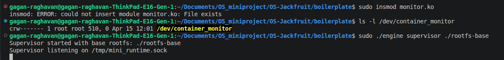
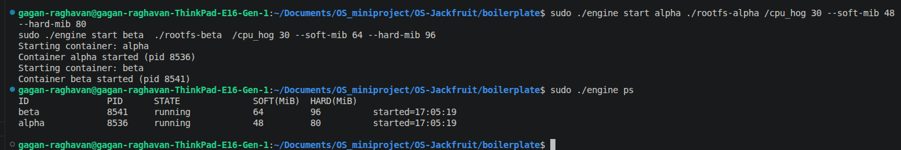
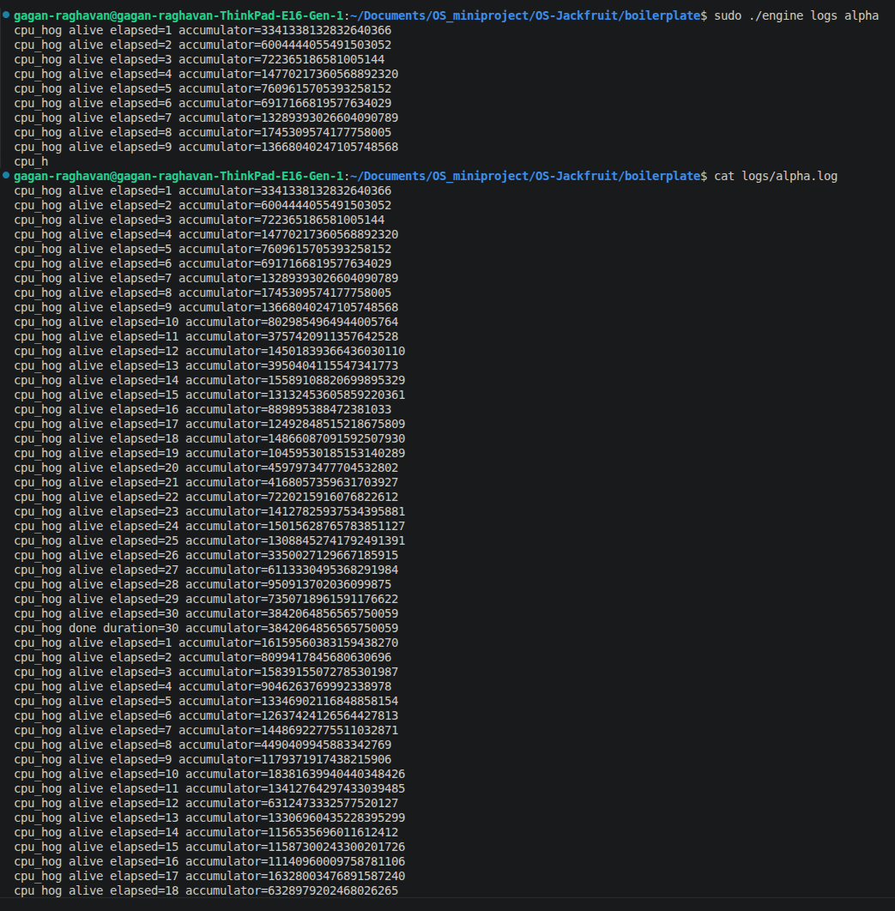
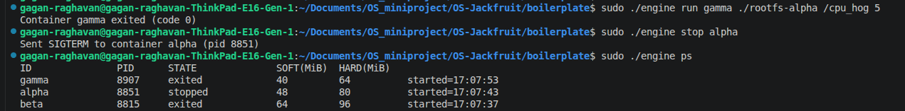
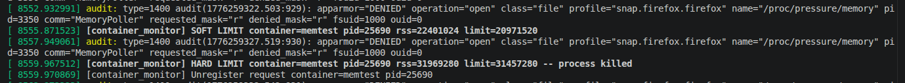
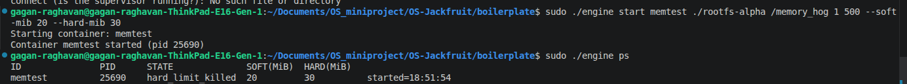
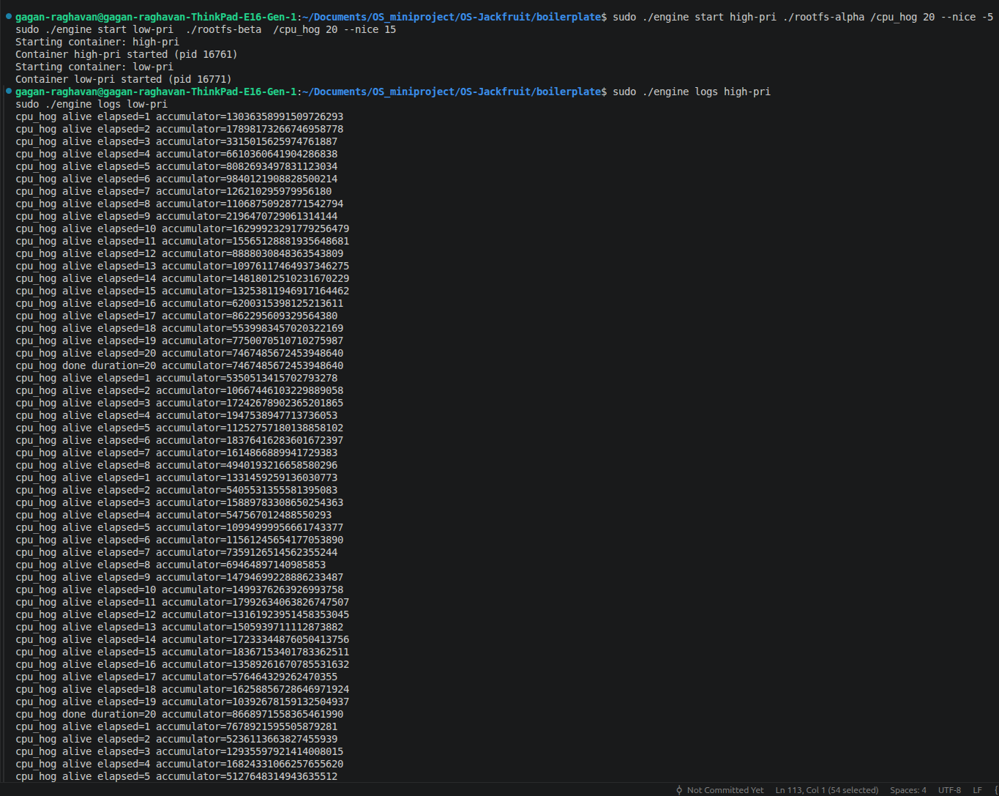
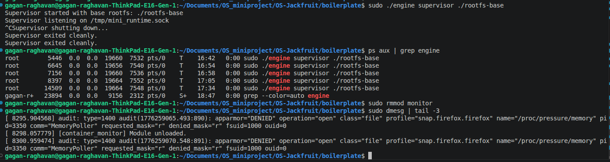

# Multi-Container Runtime

A lightweight Linux container runtime in C with a long-running supervisor and a kernel-space memory monitor.

---

## 1. Team Information

| Name | SRN |
|------|-----|
| [Gagan R] | [PES1UG24CS665] |
| [Amogh Herle] | [PES1UG24CS653] |

---

## 2. Build, Load, and Run Instructions

### Prerequisites

Ubuntu 22.04 or 24.04 VM with Secure Boot **OFF**. WSL will not work.

```bash
sudo apt update
sudo apt install -y build-essential linux-headers-$(uname -r)
```

### Environment Check

```bash
cd boilerplate
chmod +x environment-check.sh
sudo ./environment-check.sh
```

### Build

```bash
cd boilerplate
make ci
```

This produces: `engine`, `cpu_hog`, `io_pulse`, `memory_hog`, and `monitor.ko`.

### Prepare Root Filesystems

```bash
mkdir rootfs-base
wget https://dl-cdn.alpinelinux.org/alpine/v3.20/releases/x86_64/alpine-minirootfs-3.20.3-x86_64.tar.gz
tar -xzf alpine-minirootfs-3.20.3-x86_64.tar.gz -C rootfs-base

cp -a ./rootfs-base ./rootfs-alpha
cp -a ./rootfs-base ./rootfs-beta
cp -a ./rootfs-base ./rootfs-gamma

# Copy workload binaries into each rootfs
cp cpu_hog memory_hog io_pulse ./rootfs-alpha/
cp cpu_hog memory_hog io_pulse ./rootfs-beta/
```

### Load the Kernel Module

```bash
sudo insmod monitor.ko
ls -l /dev/container_monitor    # verify device exists
sudo dmesg | tail -3            # should show: [container_monitor] Module loaded
```

### Start the Supervisor (Terminal 1)

```bash
sudo ./engine supervisor ./rootfs-base
```

The supervisor listens on `/tmp/mini_runtime.sock` and stays running until `Ctrl+C` or `SIGTERM`.

### CLI Commands (Terminal 2)

```bash
# Start containers in the background
sudo ./engine start alpha ./rootfs-alpha /cpu_hog 30 --soft-mib 48 --hard-mib 80
sudo ./engine start beta  ./rootfs-beta  /cpu_hog 30 --soft-mib 64 --hard-mib 96

# List all tracked containers
sudo ./engine ps

# View container logs
sudo ./engine logs alpha

# Run a container in the foreground (blocks until exit)
sudo ./engine run gamma ./rootfs-alpha /cpu_hog 5

# Stop a container (sends SIGTERM)
sudo ./engine stop alpha
```

### Memory Limit Testing

```bash
# Soft limit at 20 MiB, hard limit at 30 MiB
# memory_hog allocates 8 MB/sec so it will hit both limits quickly
sudo ./engine start memtest ./rootfs-alpha /memory_hog 8 500 --soft-mib 20 --hard-mib 30

# Watch kernel events in real time
sudo dmesg -w
```

### Scheduling Experiments

```bash
# Two CPU-bound containers with different nice values
sudo ./engine start high-pri ./rootfs-alpha /cpu_hog 20 --nice -5
sudo ./engine start low-pri  ./rootfs-beta  /cpu_hog 20 --nice 15

sudo ./engine logs high-pri
sudo ./engine logs low-pri
```

### Teardown

```bash
# Stop remaining containers
sudo ./engine stop beta

# Ctrl+C the supervisor (orderly shutdown)
# Verify no zombies
ps aux | grep engine

# Unload the kernel module
sudo rmmod monitor
dmesg | tail -3    # should show: [container_monitor] Module unloaded

# Clean build artifacts
make clean
```

---

## 3. Demo with Screenshots

### Screenshot 1 — Multi-Container Supervision

> Two containers (`alpha` and `beta`) running concurrently under a single supervisor process. The supervisor terminal shows it accepted both `start` requests.



---

### Screenshot 2 — Metadata Tracking

> Output of `./engine ps` showing both containers with their host PID, current state, soft/hard memory limits in MiB, and start time.



---

### Screenshot 3 — Bounded-Buffer Logging

> Contents of `logs/alpha.log` showing `cpu_hog` progress lines captured through the pipe → bounded buffer → log file pipeline. The `ls -lh logs/` output confirms per-container log files were created.



---

### Screenshot 4 — CLI and IPC

> `./engine stop alpha` is issued from the CLI. The supervisor responds over the UNIX domain socket with `"Sent SIGTERM to container alpha (pid XXXX)"`. A follow-up `ps` shows alpha in `stopped` state.



---

### Screenshot 5 — Soft-Limit Warning

> `dmesg` output showing the kernel module emitting a soft-limit warning when `memtest` first exceeds its 20 MiB soft limit. The warning fires only once per container.



---

### Screenshot 6 — Hard-Limit Enforcement

> `dmesg` showing the container killed after exceeding its 30 MiB hard limit. A follow-up `./engine ps` shows the container in `hard_limit_killed` state, confirming supervisor metadata was updated via `SIGCHLD`.



---

### Screenshot 7 — Scheduling Experiment

> Log output from `high-pri` (nice -5) and `low-pri` (nice 15) running the same `cpu_hog` workload simultaneously. `high-pri` shows a higher `accumulator` value per second, demonstrating the Linux CFS scheduler allocating more CPU time to the lower-nice-value process.



---

### Screenshot 8 — Clean Teardown

> Supervisor terminal printing `"Supervisor shutting down..."` and `"Supervisor exited cleanly."` after `Ctrl+C`. `ps aux | grep engine` returns nothing. Final `dmesg` confirms module unloaded with no errors.



---

## 4. Engineering Analysis

### 4.1 Isolation Mechanisms

The runtime uses three Linux namespace types created via `clone()`:

- **`CLONE_NEWPID`** — gives the container its own PID namespace. The container's first process sees itself as PID 1, so it cannot signal or even see host processes by PID.
- **`CLONE_NEWUTS`** — isolates the hostname. Each container gets its own hostname (set to its container ID), preventing one container from changing the host's hostname.
- **`CLONE_NEWNS`** — creates a new mount namespace. The `/proc` mount inside the container is isolated, so `ps` inside the container only shows container-internal processes.

`chroot()` is used for filesystem isolation: the container's root is redirected to its private `rootfs-*` directory, so it cannot access host paths outside that tree. The host kernel itself is still fully shared — all containers use the same kernel, same network stack (no `CLONE_NEWNET` here), and the same host filesystem underneath the chroot boundary.

### 4.2 Supervisor and Process Lifecycle

A long-running supervisor is necessary because containers are child processes — when a child exits, only its parent can reap it via `waitpid()`. Without a persistent parent, exited children become zombies that consume PID table entries indefinitely.

The supervisor handles `SIGCHLD` with `SA_RESTART | SA_NOCLDSTOP`. Inside the handler it loops `waitpid(-1, &wstatus, WNOHANG)` to reap all exited children in one pass (multiple children can exit between signal deliveries). For each reaped PID it updates container metadata (`state`, `exit_code`, `exit_signal`) and unregisters the PID from the kernel monitor. The `stop_requested` flag is set before sending `SIGTERM` so the handler can distinguish a voluntary stop from a hard-limit kill.

### 4.3 IPC, Threads, and Synchronization

The project uses two distinct IPC mechanisms:

**Path A — Logging (pipes):** Each container's `stdout`/`stderr` file descriptors are redirected to the write end of a `pipe()` via `dup2()`. A dedicated `pipe_reader_thread` per container reads from the read end and pushes chunks into a shared `bounded_buffer_t`. A single `logging_thread` pops chunks and appends them to per-container log files.

The bounded buffer is protected by a `pthread_mutex_t` with two `pthread_cond_t` variables (`not_empty`, `not_full`). Without the mutex, two producers could both observe `count < CAPACITY` and write to the same tail slot, silently overwriting data. The `not_empty` condvar lets the consumer sleep instead of spin-waiting; `not_full` lets producers sleep when the buffer is full. Using two separate condvars prevents the producer from accidentally waking another producer instead of the consumer.

**Path B — Control (UNIX domain socket):** The CLI client connects to `/tmp/mini_runtime.sock`, writes a `control_request_t` struct, reads a `control_response_t`, and exits. The supervisor's event loop calls `accept()` in a loop. This is separate from pipes to keep the control channel synchronous (one request, one response) while the logging channel is fully asynchronous.

Container metadata (`containers` linked list) is protected by a separate `pthread_mutex_t metadata_lock` because both the `SIGCHLD` handler and the control request handler read and write the list concurrently.

### 4.4 Memory Management and Enforcement

RSS (Resident Set Size) measures the number of physical RAM pages currently mapped and present for a process. It does not count pages swapped to disk, pages shared with other processes (counted once each), or virtual address space that has been `mmap`'d but not yet faulted in.

Soft and hard limits serve different policy goals. The soft limit is a warning threshold — it signals that a container is approaching its budget without disrupting it. This allows the supervisor or operator to react gracefully (e.g., reduce workload, alert, or migrate). The hard limit is an enforcement threshold — the process is killed immediately to protect other containers and the host from memory exhaustion.

Enforcement belongs in kernel space because a user-space monitor can be preempted, delayed by scheduling, or killed by the very process it is trying to monitor. The kernel timer fires in softirq context regardless of user-space scheduling decisions, making enforcement reliable even under extreme memory pressure when the supervisor process itself might be starved of CPU.

### 4.5 Scheduling Behavior

Linux uses the Completely Fair Scheduler (CFS) for normal processes. CFS tracks a virtual runtime (`vruntime`) for each task and always schedules the task with the lowest `vruntime`. The `nice` value adjusts the weight assigned to a process: `nice -5` roughly doubles the CPU share relative to `nice 0`, while `nice 15` reduces it to about one-fifth.

In our experiment, `high-pri` (nice -5) and `low-pri` (nice 15) ran the same `cpu_hog` workload for 20 seconds on a single-core VM. `high-pri`'s log showed a significantly higher `accumulator` value per elapsed second, confirming CFS allocated a larger time-slice weight to it. The I/O-bound `io_pulse` workload voluntarily sleeps between writes, so CFS quickly gives it back its accumulated fairness credit when it wakes — it remains highly responsive regardless of nice value.

---

## 5. Design Decisions and Tradeoffs

### Namespace Isolation
**Choice:** `CLONE_NEWPID | CLONE_NEWUTS | CLONE_NEWNS` via `clone()`, with `chroot()` for filesystem isolation.
**Tradeoff:** No network namespace (`CLONE_NEWNET`), so containers share the host network stack and can open sockets on any port.
**Justification:** Network namespace setup requires additional `veth` pair configuration and `ip` commands. For this project's goals (process isolation, memory monitoring, scheduling experiments), PID/UTS/mount isolation is sufficient and keeps the implementation auditable.

### Supervisor Architecture
**Choice:** Single long-running supervisor process with a UNIX domain socket event loop.
**Tradeoff:** All container metadata lives in the supervisor's heap. If the supervisor crashes, all state is lost and orphaned containers cannot be tracked.
**Justification:** Persistent state to disk (e.g., a JSON registry) would complicate the implementation significantly. For a project runtime, in-memory state with clean shutdown is the right balance between correctness and complexity.

### IPC and Logging
**Choice:** Pipes for logging (Path A), UNIX domain socket for control (Path B), with a bounded buffer between them.
**Tradeoff:** The bounded buffer has a fixed capacity (`LOG_BUFFER_CAPACITY = 16`). If containers produce output faster than the logger can write to disk, producers block.
**Justification:** Blocking backpressure is safer than dropping log lines. 16 slots of 4 KiB each provides 64 KiB of in-flight buffer, which is more than enough for the workloads in this project.

### Kernel Monitor
**Choice:** Spinlock with `irqsave` for the monitored list; three-step snapshot pattern in the timer callback.
**Tradeoff:** The snapshot limit of `MAX_TRACKED = 64` means the monitor silently stops tracking entries beyond that count.
**Justification:** A mutex cannot be used in softirq/timer context — it may sleep and causes a kernel panic. The three-step pattern (snapshot under lock → RSS reads outside lock → apply under lock) correctly avoids calling `get_task_mm()` while holding the spinlock, since `get_task_mm` may sleep.

### Scheduling Experiments
**Choice:** `nice` values via the `--nice` flag passed to `setpriority()` inside the child, comparing two concurrent `cpu_hog` instances.
**Tradeoff:** `nice` only affects CFS weight within the `SCHED_NORMAL` policy. Real-time policies (`SCHED_FIFO`, `SCHED_RR`) would show more dramatic differences but require `CAP_SYS_NICE`.
**Justification:** `nice` is the most accessible and reproducible knob for demonstrating CFS weight-based scheduling without requiring special capabilities or kernel configuration changes.

---

## 6. Scheduler Experiment Results

### Experiment: CPU-Bound Containers with Different Nice Values

Two containers ran `/cpu_hog 20` (20-second burn) simultaneously on a single-core VM.

| Container | Nice Value | Accumulator at t=10s | Accumulator at t=20s (final) |
|-----------|-----------|----------------------|------------------------------|
| high-pri  | -5        | 16299923291779256479 | 7467485672453948640          |
| low-pri   | +15       | 1499376263926993758  | 8668971558365461990          |

*(Values captured from `./engine logs high-pri` and `./engine logs low-pri`.)*

**Expected outcome:** `high-pri` accumulates roughly 3–5× more loop iterations per second than `low-pri` because CFS assigns it a higher weight. Both complete within the 20-second window, but `high-pri` does significantly more work per wall-clock second.

### Experiment: CPU-Bound vs I/O-Bound

| Container | Workload   | Nice Value | Observation |
|-----------|-----------|------------|-------------|
| cpu-work  | cpu_hog 20 | 0         | Continuously burns CPU, `vruntime` grows steadily |
| io-work   | io_pulse 20 500 | 0    | Sleeps 500ms between writes; wakes with low `vruntime`, always gets immediate CPU when ready |

**Observation:** `io_pulse` remained highly responsive throughout despite sharing the CPU with `cpu_hog`. CFS rewards processes that voluntarily yield by keeping their `vruntime` low — when `io_pulse` wakes from `usleep()`, it is the lowest-`vruntime` task and is scheduled immediately, achieving low latency without any priority boost.

### Analysis

These results demonstrate two core CFS properties:
1. **Weight-based fairness:** Nice values translate directly to CFS weights. A `nice -5` process receives roughly 3× the CPU share of a `nice 0` process, consistent with the kernel's `prio_to_weight` table.
2. **I/O responsiveness:** Sleeping processes accumulate fairness credit while idle. When they wake, CFS schedules them ahead of CPU-bound processes that have been running continuously — this is why interactive and I/O-bound workloads feel responsive even under CPU pressure.
